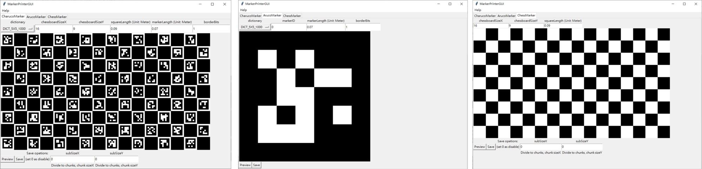
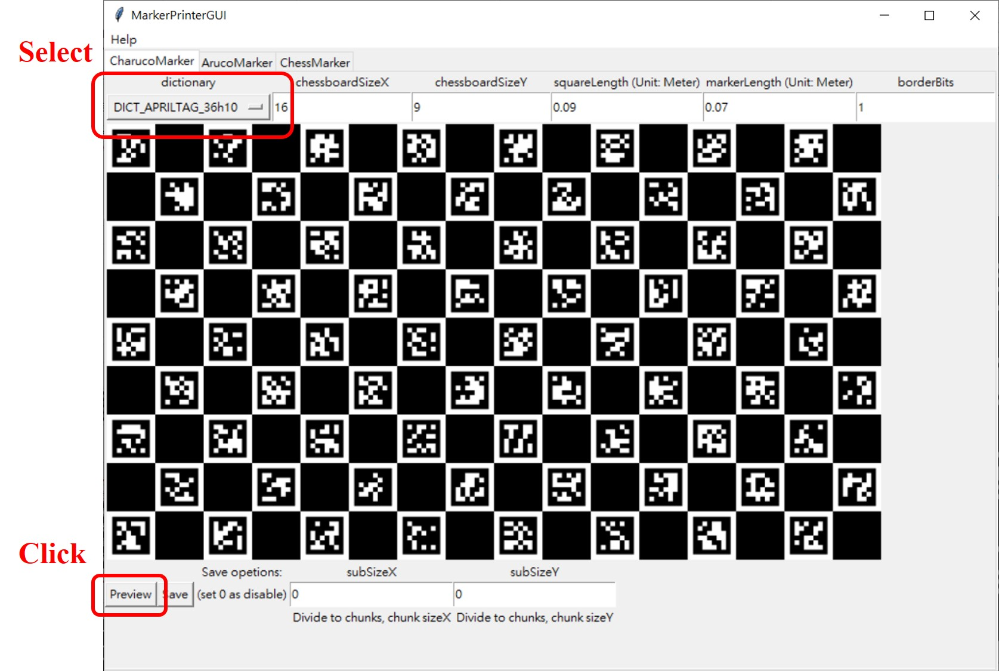
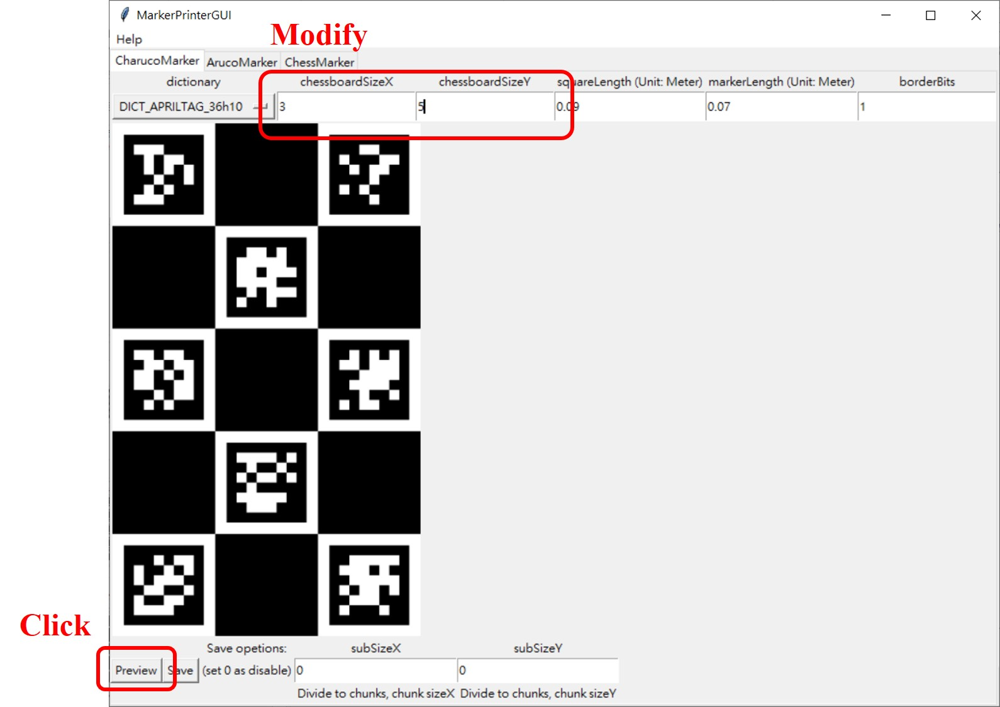
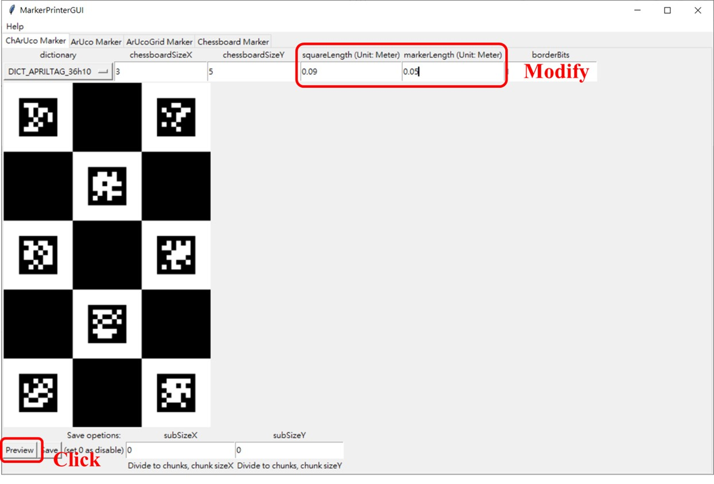
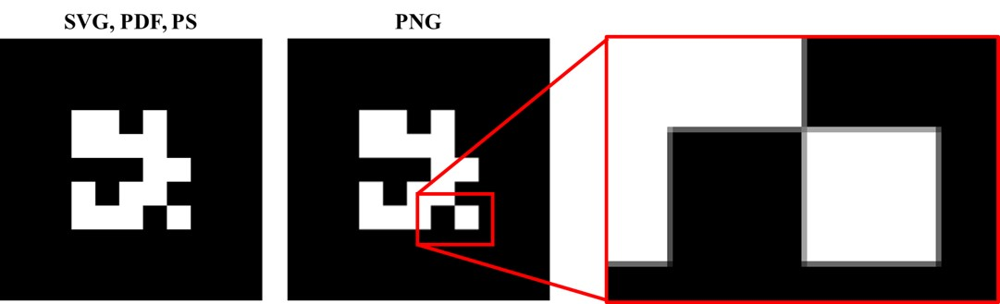
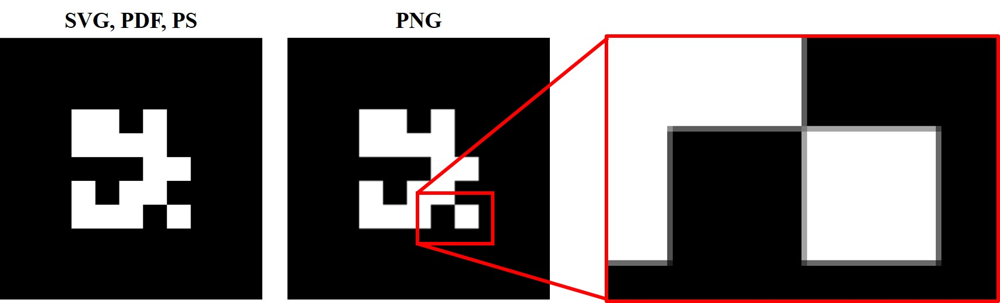
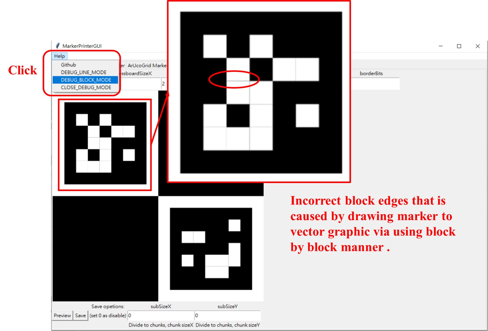

# OpenCVMarkerPrinter

## Description
This small app can save some commonly used opencv markers such as ArUco, ArUcoGrid, Chessboard and ChArUco to vector graphics file. **Supported vector graphics file format: .svg, .pdf and .ps. Supported image file format: .png (not recommend).**

### Dependencies
#### MarkerPrinter
  * numpy
  * opencv-python
  * opencv-contrib-python
  * cairo(for drawing vector graphic)
  * cairosvg(for svg to png)

#### MarkerPrinterGUI
  * tkinter(for GUI)
  * PIL(Pillow, for image processing)

## Tutorial
### Seletct dictionary:

### Modify size:

### Modify border:

## Useful Options:
### Divde output to chunks
If you are using consumer level printer, you will suffer from not able printing too large marker, so just set subSize before saving the marker to files, it will divide output marker to chunks.

## Note:
### Why PNG is not recommend
PNG will suffer from artifact problem after scaling:

### Algorithm
This application use "wall follower maze solving algorithm" to draw the marker, and it is useful to avoid some problems.
