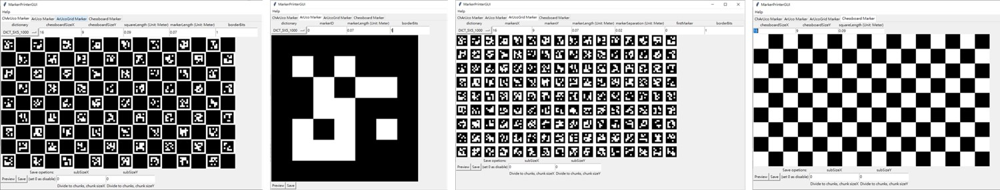

# OpenCVMarkerPrinter

## Description
This small app can save some commonly used opencv markers such as ArUco, ArUcoGrid, Chessboard and ChArUco to vector graphics file. **Supported vector graphics file format: .svg, .pdf and .ps.**

### Dependencies
#### MarkerPrinter
  * numpy
  * PIL(Pillow, for image processing)
  * cairo(for drawing vector graphic)
  * cairosvg(for svg to png)

#### MarkerPrinterGUI
  * tkinter(for GUI)

## Tutorial
You can switch ArUco, ArUcoGrid, Chessboard and ChArUco mode at the GUI tab, then you can select dictionary from the GUI menu and modify board shape, marker size, border width... etc. at the GUI entry, finally click the preview or save button to show the marker image on the GUI window or save it to file.

## Useful Options:
### Divde output to chunks
If you are using consumer level printer, you will suffer from not able printing too large marker, so just set chunks shape at the GUI subSize entry before saving the marker to files, it will divide output marker to chunks. 